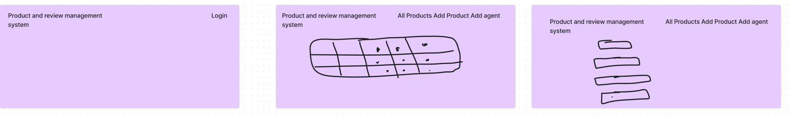

# Product Review Management System

Product Review Management System is your one stop portal to manage all your products , Sales agents. using this portal you can
Add your products and edit

Add a Sales Agent your interacted with and tagg them to respective product

View all your product catalouge at one place

-Login to get started

### MVP Features
1. Welcome screen 
2. Add  / view/ edit and delete Product
3. Add Sales agent and tag to a product
4. google authentication login  / logout

## Project  Wireframes

## Technologies used

HTML, CSS, JavaScript, node, express , passport

## Project User Stories 
1. As a user I want to see home page so that I can understand purpose of the website / portal.
2. As a user I want the  ability to view / edit / delete products so that I can organise my product catalouge.
3.  As a user I want to see add required sales agent i worked with to respective product.
4.  As a user I want to protect my products and sales agent details using google authentication so that unauthorised users cant access my details.
   
###  Future Roadmap
1. Implement analytics
2. Implement accessibality
3. Integrate with social media for sharing

## Contributing
Initial version created by : Kiran 